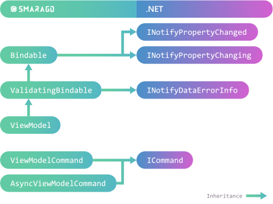

# 

[](https://github.com/nkristek/Smaragd/actions)
[](https://www.nuget.org/packages/NKristek.Smaragd/)

This is a very lightweight library containing base classes for implementing .NET applications using the MVVM architecture.
It is fully unit tested and platform independent.

## Features

Smaragd offers base implementations of key .NET interfaces for building WPF / MVVM applications.



In addition, it enables developers to:

- Build dialog and tree structures via [`DialogModel`](https://github.com/nkristek/Smaragd/wiki/DialogModel) and [`TreeViewModel`](https://github.com/nkristek/Smaragd/wiki/TreeViewModel)
- Execute commands synchronously and asynchronously via [`ViewModelCommand`](https://github.com/nkristek/Smaragd/wiki/Commands) and [`AsyncViewModelCommand`](https://github.com/nkristek/Smaragd/wiki/Commands)
- Perform validation via [`FuncValidation`](https://github.com/nkristek/Smaragd/blob/master/src/Smaragd/Validation/FuncValidation.cs) and [`PredicateValidation`](https://github.com/nkristek/Smaragd/blob/master/src/Smaragd/Validation/PredicateValidation.cs)
- Manage state updates for interdependent properties via [`PropertySourceAttribute`](https://github.com/nkristek/Smaragd/wiki/ViewModel#propertysourceattribute)

For more information, please visit the [documentation](https://github.com/nkristek/Smaragd/wiki).

## Installation

The recommended way to use this library is via [NuGet](https://www.nuget.org/packages/NKristek.Smaragd/).

Currently supported frameworks:
- .NET Standard 2.0 or higher
- .NET Framework 4.5 or higher

## Quick Start

The following is a simple demonstration of some core features of Smaragd.

1. Choose a base class for your **ViewModel**.

   - Inherit from [`ViewModel`](https://github.com/nkristek/Smaragd/wiki/ViewModel) if you want to use the fill feature set (recommended)
   - Inherit from [`Bindable`](https://github.com/nkristek/Smaragd/wiki/Bindable) if you only want an implementation of `INotifyPropertyChanged` and `INotifyPropertyChanging`

    ```csharp
    class AppViewModel : ViewModel
    {
        // ...
    }
    ```

2. Add a property with a backing field that invokes `PropertyChanged` when set.

    ```csharp
    class AppViewModel : ViewModel
    {
            private string _name;
            public string Name
            {
                get => _name;
                set => SetProperty(ref _name, value);
            }
    }
    ```

3. Make the property dependent on the `ViewModel`'s `IsDirty` property. `IsDirty` indicates whether property values have changed. The `Name` property then automatically updates observing views when `IsDirty` changes.

    ```csharp
    class AppViewModel : ViewModel
    {
            private string _name;

            [PropertySource(nameof(IsDirty))]
            public string Name
            {
                get => IsDirty ? $"{_name} (unsaved changes)" : _name;
                set => SetProperty(ref _name, value);
            }
    }
    ```

4. Add an async command to reset the `IsDirty` flag.

    ```csharp
    class AppViewModel : ViewModel
    {
        private string _name;

        [PropertySource(nameof(IsDirty))]
        public string Name
        {
            get => IsDirty ? $"{_name} (unsaved changes)" : _name;
            set => SetProperty(ref _name, value);
        }


        private IViewModelCommand<AppViewModel> _saveCommand;

        [IsDirtyIgnored]
        [IsReadOnlyIgnored]
        public IViewModelCommand<AppViewModel> SaveCommand => _saveCommand ??= new SaveCommand(this)
    }


    class SaveCommand : AsyncViewModelCommand<AppViewModel>
    {
        public SaveCommand(AppViewModel context)
        {
            Context = context;
        }

        protected override async Task ExecuteAsync(AppViewModel viewModel, object parameter)
        {
            // SaveChanges(viewModel);
            viewModel.IsDirty = false;
        }
    }
   ```

5. Create a view in XAML for your `ViewModel` and enjoy working with bindings.

    ```xml
    <Window Title="{Binding Name}">
        <Button Command="{Binding SaveCommand}">
    </Window>
    ```

In case you would like to see a more advanced reference application please don't hesitate to visit my other project [Stein](https://github.com/nkristek/Stein).

## Why another MVVM library?

This library originated in my other project [Stein](https://github.com/nkristek/Stein) and was subsequently moved to its own repository and nuget package. The goal is to provide a great yet minimal foundation which also promotes a good code style. Nearly everything is marked virtual ([except events](https://msdn.microsoft.com/en-us/library/hy3sefw3.aspx)) so you can customize it to fit your needs.

And of course, this library is [🚀blazing fast🚀](https://twitter.com/acdlite/status/974390255393505280).

## Contribution

If you find a bug feel free to open an issue. Contributions are also appreciated.
